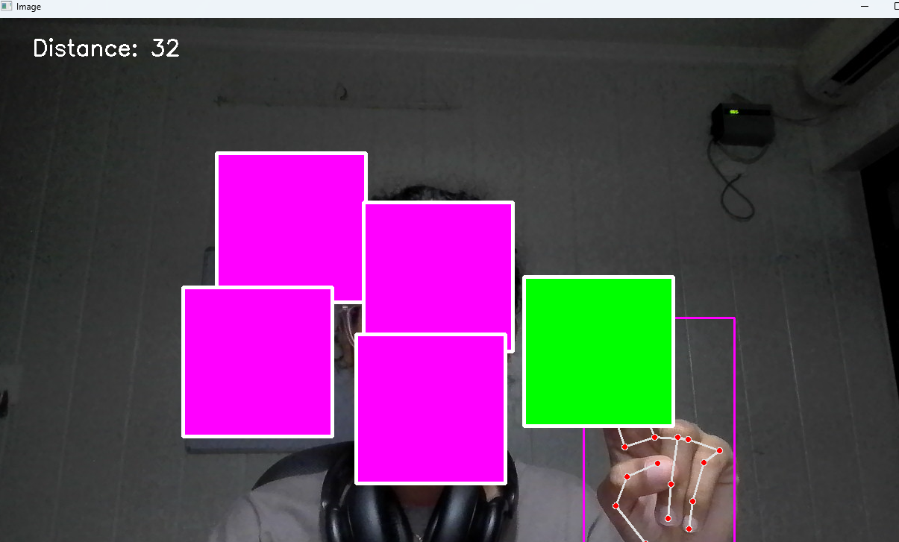

# Virtual Drag and Drop 🎯

<div align="center">


</div>

A computer vision project that enables virtual drag-and-drop functionality using hand gestures and OpenCV. Control multiple draggable rectangles on screen using pinch gestures detected through your webcam.

<div align="center">

**[View Demo](#-demo) • [Installation](#-installation) • [Usage](#-usage) • [Contributing](#-contributing)**

</div>

## ✨ Features

- 🖐️ **Hand Gesture Recognition**: Uses MediaPipe for accurate hand landmark detection
- 🤏 **Pinch-to-Drag**: Drag objects by pinching your index finger and middle finger together
- 📦 **Multiple Objects**: Supports multiple draggable rectangles simultaneously
- 🎨 **Real-time Feedback**: Visual feedback with color changes when objects are being dragged
- ⚡ **Smooth Interaction**: Responsive hand tracking with adjustable sensitivity

## 🚀 Demo

<div align="center">

<!-- Replace with your actual demo GIF -->


*Drag rectangles around the screen using simple hand gestures!*

</div>

## 🛠️ Technologies Used

<div align="center">

| Technology | Purpose |
|------------|---------|
|  | Core programming language |
|  | Computer vision and image processing |
|  | Hand landmark detection and tracking |
| CVZone | Simplified computer vision operations |

</div>

## 📋 Prerequisites

<div align="center">


</div>

Before running this project, make sure you have:

- ✅ Python 3.7 or higher
- 📹 A working webcam
- 💡 Good lighting conditions for optimal hand detection

## 🔧 Installation

<details>
<summary><b>📦 Step-by-step Installation Guide</b></summary>

### 1. Clone the repository
```bash
git clone https://github.com/yourusername/virtual-drag-drop.git
cd virtual-drag-drop
```

### 2. Create a virtual environment
```bash
python -m venv venv
```

### 3. Activate the virtual environment

**Windows:**
```bash
venv\Scripts\activate
```

**macOS/Linux:**
```bash
source venv/bin/activate
```

### 4. Install required packages
```bash
pip install -r requirements.txt
```

**Or install manually:**
```bash
pip install opencv-python cvzone mediapipe
```

</details>

## 🎮 Usage

<div align="center">

### Quick Start

</div>

1. **🚀 Run the application**
   ```bash
   python main.py
   ```

2. **🖐️ Hand Gestures:**

   <div align="center">
   
   | Gesture | Action | Description |
   |---------|--------|-------------|
   | 🤏 | **Pinch** | Bring index and middle finger together |
   | 👆 | **Point** | Move over rectangle to grab it |
   | 🖐️ | **Open Hand** | Release the rectangle |
   
   </div>

3. **⌨️ Keyboard Controls:**
   - Press `Q` to quit the application

<div align="center">

### 🎯 How to Interact

```
Position Hand → Pinch Gesture → Move to Drag → Release to Drop
```

</div>

## ⚙️ Configuration

<details>
<summary><b>🔧 Customization Options</b></summary>

You can customize the application by modifying these parameters in `main.py`:

```python
# 📹 Camera Settings
cap.set(3, 1280)  # Width
cap.set(4, 720)   # Height

# 🖐️ Hand Detection
detector = HandDetector(detectionCon=0.8)  # Detection confidence

# 🤏 Pinch Sensitivity
if l < 50:  # Lower = more sensitive

# 📦 Rectangle Properties  
DragRect([x * 250 + 150, 150], size=[200, 200])
```

</details>

## 📁 Project Structure

```
virtual-drag-drop/
├── 📄 main.py              # Main application file
├── 📖 README.md            # Project documentation  
├── 📋 requirements.txt     # Python dependencies
├── 🚫 .gitignore          # Git ignore file
└── 🎬 demo.gif            # Demo animation
```

## 🔧 Troubleshooting

<details>
<summary><b>❗ Common Issues & Solutions</b></summary>

### 📹 Camera Issues
- **Problem**: Camera not opening
- **Solution**: 
  - Check if another app is using the camera
  - Try: `cv2.VideoCapture(1)` instead of `cv2.VideoCapture(0)`

### 🖐️ Hand Detection Issues  
- **Problem**: Hand not detected
- **Solutions**:
  - ✅ Ensure good lighting
  - ✅ Keep hand clearly visible
  - ✅ Adjust `detectionCon` parameter

### 📦 Rectangle Not Responding
- **Problem**: Objects won't drag
- **Solutions**:
  - ✅ Check pinch distance on screen
  - ✅ Adjust sensitivity threshold
  - ✅ Ensure hand is in camera view

</details>

## 🤝 Contributing

<div align="center">

**We welcome contributions! 🎉**

[](https://github.com/yourusername/virtual-drag-drop/graphs/contributors)
[](https://github.com/yourusername/virtual-drag-drop/issues)
[](https://github.com/yourusername/virtual-drag-drop/pulls)

</div>

### How to Contribute:

1. 🍴 **Fork** the repository
2. 🌿 **Create** a feature branch 
   ```bash
   git checkout -b feature/amazing-feature
   ```
3. 💾 **Commit** your changes 
   ```bash
   git commit -m 'Add amazing feature'
   ```
4. 📤 **Push** to the branch 
   ```bash
   git push origin feature/amazing-feature
   ```
5. 🔄 **Open** a Pull Request

## 🚀 Future Enhancements

<div align="center">

### 🎯 Roadmap

</div>

- [ ] 🔄 **More Gestures** - Add rotate and resize controls
- [ ] 🎨 **Different Shapes** - Support circles, triangles, custom objects  
- [ ] 💾 **Save/Load** - Persist object positions
- [ ] 👥 **Multi-Hand** - Simultaneous dragging with both hands
- [ ] 👆 **Touch-Free Click** - Air tap gestures
- [ ] 🎲 **3D Objects** - Three-dimensional manipulation
- [ ] 🎵 **Sound Effects** - Audio feedback for interactions
- [ ] 📱 **Mobile Support** - Smartphone camera integration

## 📄 License

<div align="center">

This project is licensed under the **MIT License** - see the [LICENSE](LICENSE) file for details.

[](https://opensource.org/licenses/MIT)

</div>

## 🙏 Acknowledgments

<div align="center">

**Special Thanks To:**

[](https://mediapipe.dev/)
[](https://opencv.org/)
[](https://github.com/cvzone/cvzone)

</div>

- 🏆 **MediaPipe** team for excellent hand tracking technology
- 🎯 **CVZone** for simplified computer vision operations  
- 👁️ **OpenCV** community for comprehensive computer vision tools

## 👨‍💻 Author

<div align="center">

**Khushi Yadav**

[](https://github.com/jessica-murare)
[](www.linkedin.com/in/khushi-yadav-81170a310)
[](mailto:yadavkhushi.31.01@gmail.com)

</div>

---

<div align="center">

### ⭐ **If you found this project helpful, please give it a star!** ⭐

**Made with ❤️ and Python**

[](https://github.com/yourusername/virtual-drag-drop/stargazers)
[](https://github.com/yourusername/virtual-drag-drop/network/members)

</div>
